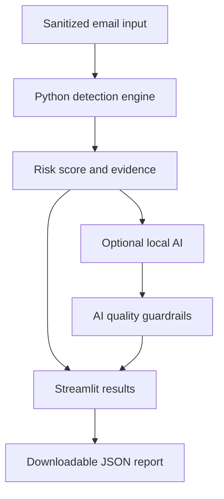

# AI Phishing Email Analyzer

A defensive email-analysis application that combines transparent, rule-based phishing detection with an optional local-AI explanation generated through Ollama.

The application examines sanitized email content, assigns a risk score, identifies suspicious evidence, extracts URLs and sender-domain information, and produces a downloadable JSON report for analyst review.

> Training and portfolio project only. Automated findings must be validated by a human analyst.

## Portfolio Report

📄 **[Open the complete AI Phishing Email Analyzer Portfolio Report](evidence/AI_Phishing_Email_Analyzer_Portfolio_Report.pdf)**

The illustrated report documents the application interface, architecture, sanitized test emails, detection results, false-negative corrections, Local-AI guardrails, annotated code excerpts, automated testing, limitations, and GitHub publication workflow.

## Project Overview

This project demonstrates how deterministic security rules and locally hosted AI can work together without allowing a generative model to control the security classification.

The Python detection engine determines:

- Risk score
- Risk level
- Suspicious-language indicators
- Sender-domain evidence
- Brand-impersonation evidence
- URL-related risks
- Extracted URLs

The optional local-AI component explains the possible impact of the verified evidence. It cannot modify the score, classification, indicators, or URL count.

## Key Features

- Transparent rule-based risk scoring
- Low, Medium, and High risk classifications
- Sender-domain extraction
- Multiline email-header parsing
- Suspicious-language detection
- Microsoft and HMRC impersonation detection
- Insecure HTTP URL detection
- IP-address URL detection
- URL-shortener detection
- Punycode-domain detection
- Dangerous file-extension detection
- Sanitized `.txt` and `.eml` file uploads
- Built-in Low, Medium, and High test samples
- Optional local-AI explanation using Ollama
- AI output validation and deterministic fallback
- Downloadable privacy-conscious JSON reports
- Automated regression and AI-guardrail tests

## Application Architecture



The application separates detection from explanation:

1. `analyzer.py` extracts evidence and calculates the score.
2. `ai_explainer.py` creates a constrained explanation of potential impact.
3. `app.py` provides the Streamlit interface and JSON-report download.
4. The AI never determines the risk score.

## Project Structure

```text
ai-phishing-email-analyzer/
├── app.py
├── analyzer.py
├── ai_explainer.py
├── requirements.txt
├── README.md
├── .gitignore
├── tests/
│   ├── test_analyzer.py
│   └── test_ai_explainer.py
├── samples/
└── evidence/
    ├── README.md
    └── AI_Phishing_Email_Analyzer_Portfolio_Report.pdf
```

## Requirements

### Required

- Python 3.10 or later
- `venv` support
- Streamlit

### Optional

- Ollama
- `qwen2.5:1.5b` local model

Ollama is not required to use the rule-based detection engine or run the automated tests.

## Installation

### 1. Clone the repository

```bash
git clone https://github.com/Payinde/ai-phishing-email-analyzer.git
cd ai-phishing-email-analyzer
```

### 2. Create a virtual environment

```bash
python3 -m venv .venv
```

A virtual environment keeps the project dependencies separate from the operating system’s Python packages.

### 3. Activate the virtual environment

Linux or macOS:

```bash
source .venv/bin/activate
```

Windows PowerShell:

```powershell
.venv\Scripts\Activate.ps1
```

### 4. Upgrade pip

```bash
python -m pip install --upgrade pip
```

### 5. Install the project requirements

```bash
pip install -r requirements.txt
```

## Run the Automated Tests

```bash
python -m unittest discover -s tests -v
```

Expected result:

```text
Ran 13 tests

OK
```

The tests validate:

- Legitimate email classification
- Medium-risk suspicious email classification
- High-risk phishing simulation
- HMRC refund impersonation
- Microsoft password-expiration impersonation
- Outlook account-reactivation impersonation
- Maximum score enforcement
- Exact evidence and URL counts
- Repetitive AI wording detection
- Unsupported AI claim rejection
- Invalid AI text-fragment rejection
- Safe fallback explanations

## Run the Application

```bash
streamlit run app.py
```

Streamlit normally opens the application at:

```text
http://localhost:8501
```

To make the application accessible from another system on the same authorized lab network:

```bash
streamlit run app.py --server.address 0.0.0.0
```

Then open:

```text
http://SERVER-IP:8501
```

Replace `SERVER-IP` with the IP address of the machine hosting the application.

Do not expose the development server directly to the public Internet.

## Optional Local-AI Setup

The main analyzer works without AI. Ollama is only used to generate an additional explanation of potential impact.

Install Ollama using the instructions for your operating system:

[https://ollama.com/download](https://ollama.com/download)

Download the configured model:

```bash
ollama pull qwen2.5:1.5b
```

Verify that the model is installed:

```bash
ollama list
```

If Ollama is not already running, start it:

```bash
ollama serve
```

After launching the Streamlit application, enable:

```text
Generate a local-AI explanation with Ollama
```

If Ollama times out, returns malformed text, or is unavailable, the rule-based assessment remains available and the application uses a safe fallback explanation.

## Safe Testing Instructions

Use only sanitized or synthetic email content.

Do not upload:

- Passwords
- Authentication tokens
- Private email addresses
- Confidential company information
- Live malicious attachments
- Sensitive email headers
- Active malicious URLs

The application analyzes text. It does not need to visit an extracted URL.

Reserved domains such as `.test` should be used for demonstrations.

## Sample — Legitimate Email

```text
From: HR Department <hr@example.test>
To: employee@example.test
Subject: Updated holiday schedule

Hello team,

The updated holiday schedule is available on the internal employee portal.

Please contact Human Resources if you have any questions.

Regards,
HR Department

This is a safe, synthetic training sample.
```

Expected result:

```text
Risk level: Low
Risk score: 0/100
```

## Sample — Outlook Account Reactivation

```text
From: Microsoft Account Team <account-team@outlook-support.example.test>
To: user@example.test
Subject: Reactivate Your Outlook Account

Dear User,

Your Hotmail account services have expired.

You must reactivate your account for it to remain active.

Sign in and reactivate your account:

https://account-live.example.test/reactivate

Thanks,

The Microsoft Account Team
```

Expected result:

```text
Risk level: High
Risk score: 70/100
Sender domain: outlook-support.example.test
Indicators: 4
Extracted URLs: 1
```

## JSON Analysis Report

The Streamlit interface can generate a downloadable JSON report containing:

- UTC generation timestamp
- Risk level
- Risk score
- Sender domain
- Detected indicators
- Indicator point values
- Extracted URLs
- Local-AI status
- Explanation
- Human-validation disclaimer

The raw email body is deliberately excluded from the downloaded report to reduce unnecessary retention of potentially sensitive content.

## Detection Engine v2

Initial testing revealed three false negatives:

| Simulation | Initial result | Detection Engine v2 |
|---|---:|---:|
| HMRC refund impersonation | Low — 8 | High — 68 |
| Microsoft password expiration | Low — 13 | High — 88 |
| Outlook account reactivation | Low — 0 | High — 70 |

Detection Engine v2 addressed these gaps by adding:

- Expanded social-engineering phrases
- Sender-domain extraction
- Multiline email-header parsing
- Brand-language recognition
- Brand and sender-domain validation
- Regression tests for all three simulations

All 13 automated tests passed after the improvements.

## AI Safety and Quality Controls

The local-AI model is restricted to explaining potential risk. Verified findings remain under deterministic Python control.

Python generates:

- The evidence statement
- The exact URL count
- The risk score
- The risk classification
- The analyst-validation statement

AI-generated wording is rejected if it contains:

- Unsupported claims
- Incorrect URL-count claims
- Repetitive wording
- Malformed word fragments
- Unexpected headings
- Excessively long responses
- Overconfident conclusions

If AI output fails validation, the application displays a safe deterministic fallback.

## Validated High-Risk Result

A final Outlook account-reactivation test produced:

```text
Risk level: High
Risk score: 70/100
Sender domain: outlook-support.example.test
Indicators: 4
Extracted URLs: 1
Local AI: Enabled
```

The explanation remained cautious:

```text
Evidence: The assessment detected Brand impersonation, Suspicious language.
URLs extracted: 1.

Potential risk: The combined indicators may represent phishing, credential
theft, malware delivery, or fraud.

Validation required: A human analyst must confirm the classification and
supporting evidence.
```

## Limitations

This is a training and portfolio application, not a production email-security gateway.

Current limitations include:

- Rule coverage is intentionally limited.
- A low score does not prove that an email is legitimate.
- A high score does not independently prove malicious intent.
- URLs are inspected as text and are not visited.
- Attachments are not executed or dynamically analyzed.
- Email authentication such as SPF, DKIM, and DMARC is not fully validated.
- Domain reputation and threat-intelligence feeds are not queried.
- Local-AI responses depend on model availability and system resources.
- Human analyst validation remains necessary.

## Security Design Decisions

- The application accepts sanitized content only.
- URLs are extracted but not opened.
- Ollama is executed without shell interpolation.
- The AI cannot modify deterministic findings.
- Raw email content is excluded from JSON reports.
- `.streamlit/secrets.toml` is excluded through `.gitignore`.
- Virtual environments and Python cache files are excluded from Git.
- Synthetic `.test` domains are used in demonstrations.

## Portfolio Learning Outcomes

This project demonstrates practical experience with:

- Python security-tool development
- Rule-based detection engineering
- Email-header and URL parsing
- Phishing and impersonation analysis
- False-positive and false-negative review
- Regression testing
- Secure subprocess execution
- Local generative-AI integration
- AI output guardrails
- Streamlit application development
- Privacy-aware JSON reporting
- Evidence-led security documentation

## Future Improvements

Potential future enhancements include:

- SPF, DKIM, and DMARC header analysis
- Domain-age and reputation checks
- Threat-intelligence integration
- Attachment metadata analysis
- Additional impersonated-brand profiles
- Configurable detection rules
- Export to CSV or PDF
- Structured analyst notes
- Docker deployment
- Continuous integration with GitHub Actions

## Disclaimer

This project is intended for defensive cybersecurity education, controlled testing, and portfolio demonstration.

It must not be treated as the sole basis for deciding whether an email is safe or malicious. Automated results require validation by a qualified human analyst.

## Author

**Ayinde Perouza**

- Portfolio: [https://payinde.github.io](https://payinde.github.io)
- GitHub: [https://github.com/Payinde](https://github.com/Payinde)
- LinkedIn: [https://www.linkedin.com/in/ayinde-perouza](https://www.linkedin.com/in/ayinde-perouza)
